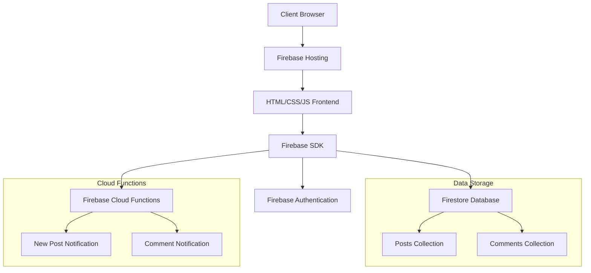
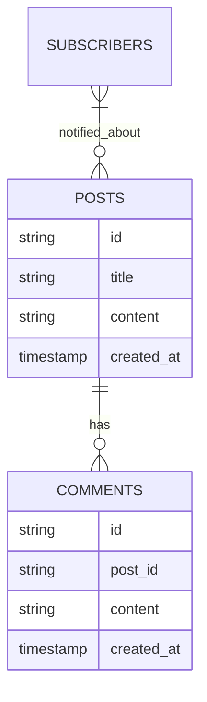

# Detailed Implementation Plan: Extending The Heimdall Project

Based on our discussion, this document outlines a comprehensive plan for extending The Heimdall Project with the following enhancements:

1. Enhance the existing comment system and integrate it into the UI
2. Move storage from localStorage to Firebase Firestore
3. Deploy the website using Firebase Hosting


## 1. Project Architecture Overview



## 2. Database Schema Design

### Firestore Collections Structure



## 3. Implementation Steps

### Phase 1: Project Setup and Firebase Integration

1. **Set up Firebase Project**
   - Create a new Firebase project
   - Enable Firestore database
   - Configure Firebase Hosting
   - Set up Firebase Cloud Functions

2. **Install Required Dependencies**
   - Firebase SDK
   - Firebase Tools (CLI)
 

3. **Initialize Firebase in the Project**
   - Add Firebase configuration to the project
   - Set up Firebase SDK initialization

### Phase 2: Migrate Data Storage to Firestore

1. **Create Firestore Collections**
   - Posts collection
   - Comments collection
   - Subscribers collection

2. **Update Post Creation Logic**
   - Modify the `submitPost()` function to store posts in Firestore instead of localStorage
   - Implement real-time updates using Firestore listeners

3. **Migrate Existing Data**
   - Create a one-time migration script to move data from localStorage to Firestore
   - Ensure data integrity during migration

### Phase 3: Enhance Comment System UI

1. **Update Post Display to Include Comments**
   - Modify the `displayPosts()` function to show comments for each post
   - Add UI elements for comment section in each post

2. **Implement Comment Functionality**
   - Update the `addComment()` function to store comments in Firestore
   - Implement real-time updates for comments using Firestore listeners
   - Enhance comment deletion functionality

3. **Style Comment UI**
   - Improve the visual appearance of comments
   - Add user-friendly interactions

### Phase 4: Implement Notification System with Firebase Cloud Functions

1. **Create Cloud Functions**
   - Implement a function for new post notifications
   - Implement a function for new comment notifications (optional)


### Phase 5: Deployment and Testing

1. **Configure Firebase Hosting**
   - Set up hosting configuration
   - Configure custom domain (if applicable)

2. **Deploy the Application**
   - Deploy frontend to Firebase Hosting
   - Deploy Cloud Functions

3. **Testing**
   - Test post creation and retrieval
   - Test comment functionality
   - Test notification system
   - Test across different devices and browsers

## 4. Detailed Code Changes

### Update index.html
- Add Firebase SDK scripts
- Update meta tags for better SEO

### Update pagetwo.html
- Add Firebase SDK scripts
- Enhance UI for comments
- Implement real-time updates

### Create firebase.js
- Firebase configuration
- Authentication setup (if needed)
- Firestore utility functions

### Replace java.js with Cloud Functions

## 5. Free Tier Usage Considerations

### Firebase Firestore
- Free tier: 1GB storage, 50,000 reads/day, 20,000 writes/day, 20,000 deletes/day
- Optimization: Implement pagination for posts to reduce read operations

### Firebase Hosting
- Free tier: 10GB storage, 360MB/day data transfer
- Optimization: Optimize images and assets

### Firebase Cloud Functions
- Free tier: 2M invocations/month, 400,000 GB-seconds, 200,000 CPU-seconds
- Optimization: Implement batching for notifications


## 6. Timeline Estimate

1. **Project Setup and Firebase Integration**: 1-2 days
2. **Migrate Data Storage to Firestore**: 2-3 days
3. **Enhance Comment System UI**: 2-3 days
4. **Implement Notification System**: 2-3 days
5. **Deployment and Testing**: 1-2 days

**Total Estimated Time**: 8-13 days

## 7. Future Enhancement Possibilities

1. **User Authentication** (optional)
   - Add anonymous authentication for better user tracking
   - Allow users to claim their posts/comments

2. **Moderation System**
   - Implement content filtering
   - Add reporting functionality

3. **Rich Text Support**
   - Add markdown or rich text editor for posts and comments

4. **Mobile Optimization**
   - Enhance mobile UI/UX
   - Consider PWA implementation

## 8. Sample Code Snippets

### Firebase Configuration

```javascript
// firebase.js
import { initializeApp } from "firebase/app";
import { getFirestore } from "firebase/firestore";
import { getFunctions } from "firebase/functions";

const firebaseConfig = {
  apiKey: "YOUR_API_KEY",
  authDomain: "your-project-id.firebaseapp.com",
  projectId: "your-project-id",
  storageBucket: "your-project-id.appspot.com",
  messagingSenderId: "YOUR_MESSAGING_SENDER_ID",
  appId: "YOUR_APP_ID"
};

// Initialize Firebase
const app = initializeApp(firebaseConfig);
const db = getFirestore(app);
const functions = getFunctions(app);

export { app, db, functions };
```

### Firestore Post Creation

```javascript
// posts.js
import { db } from './firebase';
import { collection, addDoc, serverTimestamp } from "firebase/firestore";

async function createPost(title, content) {
  try {
    const docRef = await addDoc(collection(db, "posts"), {
      title: title,
      content: content,
      created_at: serverTimestamp()
    });
    console.log("Post created with ID: ", docRef.id);
    return docRef.id;
  } catch (error) {
    console.error("Error creating post: ", error);
    throw error;
  }
}
```

### Firestore Comment Creation

```javascript
// comments.js
import { db } from './firebase';
import { collection, addDoc, serverTimestamp } from "firebase/firestore";

async function addComment(postId, content) {
  try {
    const docRef = await addDoc(collection(db, "comments"), {
      post_id: postId,
      content: content,
      created_at: serverTimestamp()
    });
    console.log("Comment added with ID: ", docRef.id);
    return docRef.id;
  } catch (error) {
    console.error("Error adding comment: ", error);
    throw error;
  }
}
```


